# AWE - Agentic Web Explorer

<div align="center">


**A production-grade multi-agent framework for autonomous web exploration and real-time data extraction.**

[](https://nextjs.org/)
[](https://fastapi.tiangolo.com/)
[](https://groq.com/)
[](https://playwright.dev/)
[](https://arxiv.org/abs/2305.10601)

[Live Demo](#live-demo) • [Architecture](#-architecture) • [Agents](#-multi-agent-system) • [ToT Reasoning](#-tree-of-thought-engine)

</div>

---

## 🎯 Overview

AWE is a sophisticated **multi-agent system** that autonomously explores websites to extract structured data. Unlike simple scrapers, AWE uses **Tree of Thought (ToT)** reasoning to plan, execute, and validate extraction strategies, enabling **Small Language Models (SLMs)** like `llama-3.1-8b` to perform on par with much larger models.

### Key Capabilities
- **Multi-Agent Coordination**: 6 specialized agents working in concert.
- **Cognitive Architecture**: Uses ToT to "think" before acting.
- **SLM Optimization**: Optimized for fast inference on modest hardware.
- **Live Extraction**: Real-time fetching from any public URL.

---

## 🏗️ Architecture

AWE uses a **Hub-and-Spoke** architecture where the **Orchestrator** coordinates specialized agents that share a central state.

```mermaid
graph TD
    User[User / Frontend] -->|Goal & URL| API[FastAPI Server]
    API -->|Task| Orch[Orchestrator]
    
    subgraph "AWE Core Engine"
        Orch -->|Coordinates| Pool[Agent Pool]
        Orch -->|Updates| State[Shared State]
        
        subgraph "Reasoning Layer"
            ToT[ToT Engine] -->|Empowers| Planner
            ToT -->|Empowers| Extractor
        end
        
        subgraph "Agent Pool"
            Observer[👀 Observer Agent]
            Planner[🧠 Planner Agent]
            Executor[⚡ Executor Agent]
            Extractor[📦 Extractor Agent]
            Validator[✅ Validator Agent]
            Learner[📚 Learner Agent]
        end
        
        Observer -->|Reads| Browser[Playwright Browser]
        Executor -->|Drives| Browser
    end
    
    Extractor -->|Data| Results[Structured Data]
```



---

## 🤖 Multi-Agent System

The system is composed of **6 specialized agents**, each with a distinct role in the extraction pipeline:

### 1. 👀 Observer Agent
*   **Role**: The "Eyes" of the system.
*   **Responsibility**: Analyzes the rendered DOM, takes screenshots, identifies page types (Listing, Detail, Home), and detects dynamic content (AJAX, Infinite Scroll).
*   **Output**: `PageObservation` object with visual and structural context.

### 2. 🧠 Planner Agent
*   **Role**: The "Brain" / Strategist.
*   **Responsibility**: Uses **Tree of Thought** to generate high-level exploration strategies. It weighs trade-offs between different approaches (e.g., "Pagination Crawl" vs. "Search Query").
*   **Output**: `ExplorationStrategy` containing a prioritized list of actions.

### 3. ⚡ Executor Agent
*   **Role**: The "Hands" of the system.
*   **Responsibility**: Interacts with the browser via Playwright. Executes planned actions like clicking, scrolling, typing, and navigating. Handles retries and error recovery.
*   **Output**: `ActionExecutionResult` (success/failure, new HTML).

### 4. 📦 Extractor Agent
*   **Role**: The Data Miner.
*   **Responsibility**: Parses content to extract the specific fields requested by the user. Adapts to different layouts (Cards, Tables, JSON-LD) using LLM-guided selectors.
*   **Output**: Raw JSON data.

### 5. ✅ Validator Agent
*   **Role**: The Quality Control.
*   **Responsibility**: Checks extracted data against validity rules (schema compliance, null checks, data types). Filters out noise and hallucinated content.
*   **Output**: `ValidationReport` and cleaned data.

### 6. 📚 Learner Agent
*   **Role**: The Optimizer.
*   **Responsibility**: Remembers successful extraction patterns for specific domains. Creates reusable templates to speed up future runs on the same website.
*   **Output**: `ExtractionTemplate` stored in Knowledge Graph.

---

## 🌳 Tree of Thought Engine

AWE implements a **Tree of Thought (ToT)** reasoning engine to solve the problem of complex web navigation and extraction. This allows the system to:

1.  **Generate Thoughts**: Propose multiple, distinct extraction strategies (e.g., "Try CSS selectors", "Try looking for JSON variables", "Try API interception").
2.  **Evaluate**: Score each strategy based on feasibility, confidence, and value.
3.  **Search**: Use Beam Search or BFS to explore the most promising strategies.
4.  **Reflect**: If a strategy fails, the system "reflects" on why and updates its plan.

> **Why ToT?**
> Standard LLM calls fail on complex sites. ToT allows **Small Language Models (SLMs)** like `llama-3.1-8b` to achieve **SOTA performance** by breaking the problem down and validating intermediate steps.

---

## 🔄 Workflow

The extraction process follows a strictly defined **6-Phase Lifecycle**:


---

## 🛠️ Tech Stack

### Frontend (`awe-landing`)
*   **Framework**: Next.js 16 (App Router)
*   **UI Library**: React 19
*   **Styling**: TailwindCSS 4
*   **State**: React Hooks
*   **Theme**: Glassmorphism (Dark Mode)

### Backend (`awe-agentic-web-explorer`)
*   **API Framework**: FastAPI
*   **Language**: Python 3.11+
*   **Browser Control**: Playwright (Async)
*   **LLM Interface**: Groq SDK / Ollama
*   **Networking**: httpx
*   **Parsing**: BeautifulSoup4, lxml

### AI Models & Engines
*   **Reasoning Model**: `llama-3.3-70b-versatile` (Groq LPU)
*   **SLM Option**: `llama-3.1-8b-instant` (High speed)
*   **Vision Support**: Experimental (GPT-4o / Llava)

---

## 🚀 Live Demo (`/demo`)

The live demo on the landing page is a **turbo-charged** version of the pipeline designed for speed.

*   **Mode**: Real-time Interactive
*   **Engine**: `tot_extractor.py` (Simplified ToT)
*   **Latency**: 3-8 seconds
*   **Capabilities**: Single-page extraction, multiple strategies

To run the full multi-agent exploration (multi-page, deep crawling), use the `/explore` API endpoint.

---

## ⚙️ Configuration

Set these in your `.env` file:

```env
# AI Provider
MODEL_PROVIDER=groq
GROQ_API_KEY=your_key_here
MODEL_NAME=llama-3.3-70b-versatile

# ToT Settings
TOT_ENABLED=true
TOT_MAX_THOUGHTS=3
TOT_SEARCH_STRATEGY=beam

# Agent Settings
HEADLESS=true
MAX_PAGES=10
```

---

<div align="center">

**[AWE] Agentic Web Explorer**
*Autonomous. Intelligent. Adaptive.*

</div>
